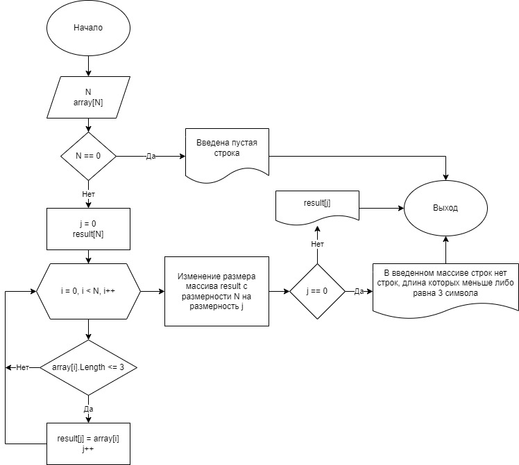

# Описание решения задачи

## Формулировка задачи

Написать программу, которая из имеющегося массива строк формирует массив из строк, длина которых меньше либо равна 3 символа. 

*Пример:*

*["hello", "2", ":-)"] -> ["2", ":-)"]*

## Алгоритм решения задачи

Пользователь с клавиатуры вводит массив строк. Далее программа начинает вычисления согласно блок-схеме алгоритма решения задачи изображенной на рисунке ниже. Результат работы программы выводится на экран. 

